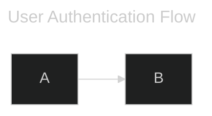
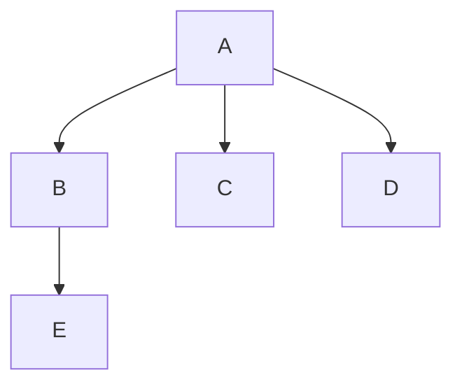

# PRD: Ferrite v0.2.5 - Mermaid Update, CSV Support, i18n & UX Polish

## Product Overview

Ferrite v0.2.5 is a substantial feature release that expands Ferrite's capabilities with CSV file support, internationalization infrastructure, improved Mermaid diagrams, a revolutionary semantic minimap, and numerous quality-of-life improvements. This release solidifies Ferrite's position as a comprehensive, user-friendly markdown editor.

## Problem Statement

After v0.2.3's editor productivity features, users and the growing community have identified several areas for improvement:

1. **Limited file format support** - Users working with CSV files have no native viewing/editing experience
2. **English-only UI** - Growing international community (especially Chinese users) want localized interface
3. **Mermaid syntax gaps** - Missing YAML frontmatter and parallel edge syntax that MermaidJS supports
4. **Session reliability issues** - Workspace folders and recent files sometimes not persisting correctly
5. **Minimap is just pixels** - Current minimap shows scaled text that's unreadable; not useful for markdown navigation
6. **Missing convenience features** - No image drag-drop, TOC generation, snippets, or keyboard customization
7. **Git integration is static** - File status indicators only refresh on folder open

## Target Users

1. **Data analysts** - Working with CSV files alongside markdown documentation
2. **International users** - Chinese, Japanese, Korean speakers who want localized UI
3. **Technical writers** - Need TOC generation, document statistics, and image management
4. **Power users** - Want keyboard customization and text snippets
5. **Diagram creators** - Using advanced Mermaid syntax features

## Goals

1. Add native CSV file support with table viewing and rainbow column coloring
2. Build i18n infrastructure for community translations, starting with Simplified Chinese
3. Enhance Mermaid with YAML frontmatter, parallel edges, and performance optimization
4. Create a semantic minimap that shows actual document structure
5. Fix session persistence bugs and improve Git integration
6. Add user-requested features: drag-drop images, TOC, snippets, keyboard shortcuts

## Non-Goals

1. Full CSV editing (cell-level operations) - defer to future version
2. Complete translation of all languages - start with infrastructure + Chinese
3. Custom Mermaid themes - keep current theme integration
4. Memory-mapped large file support - defer to v0.5.0+

---

## Feature Specifications

### 1. Mermaid Improvements

#### 1.1 YAML Frontmatter Support
Parse `---` metadata blocks at the start of mermaid code blocks (MermaidJS v8.13+ syntax).

**Acceptance Criteria:**
- Parse frontmatter with `title:`, `config:`, and other metadata keys
- Apply title as diagram label if present
- Gracefully ignore unknown keys
- Don't break existing diagrams without frontmatter

**Example:**


#### 1.2 Parallel Edge Operator (`&`)
Support `A --> B & C & D` syntax for multiple edges from one source node.

**Acceptance Criteria:**
- Parse `&` operator to create multiple edges from single source
- Apply to all diagram types that support edges (flowchart, sequence, state)
- Maintain edge styling and labels per-segment

**Example:**


#### 1.3 Rendering Performance
Optimize mermaid.rs for complex diagrams.

**Acceptance Criteria:**
- Cache parsed AST and layout for unchanged diagrams
- Only re-render when diagram source text changes
- Measure and improve render time for 50+ node diagrams

#### 1.4 Code Cleanup
Address technical debt in mermaid module.

**Acceptance Criteria:**
- Eliminate unused code warnings
- Improve module organization and documentation
- No functional changes, just cleanup

#### 1.5 Diagram Insertion Toolbar ([#4](https://github.com/OlaProeis/Ferrite/issues/4))
Add toolbar button to insert mermaid code block templates.

**Acceptance Criteria:**
- Button in formatting toolbar opens diagram type picker
- Options: Flowchart, Sequence, State, Class, ER, Pie, Mindmap, Timeline, Gantt, Git Graph, User Journey
- Insert template code block at cursor position
- Template includes basic example syntax

#### 1.6 Syntax Hints in Help ([#4](https://github.com/OlaProeis/Ferrite/issues/4))
Document supported diagram types and syntax examples.

**Acceptance Criteria:**
- Help menu or panel shows supported diagram types
- Each type has basic syntax example
- Link to MermaidJS documentation for advanced syntax

---

### 2. CSV Support ([#19](https://github.com/OlaProeis/Ferrite/issues/19))

Native CSV file viewing with specialized table display.

#### 2.1 CSV Tree Viewer
Table view with fixed-width column alignment (like EmEditor).

**Acceptance Criteria:**
- Detect `.csv`, `.tsv` files and show in table view mode
- Fixed-width columns based on content width
- Horizontal and vertical scrolling
- Click on cell to see full content (for truncated cells)

#### 2.2 Rainbow Column Coloring
Alternating column colors for readability (like RainbowCSV extension).

**Acceptance Criteria:**
- Each column has distinct background color
- Colors work in both light and dark themes
- Subtle, non-distracting color palette
- Optional toggle in settings

#### 2.3 Delimiter Detection
Auto-detect comma, tab, semicolon, pipe separators.

**Acceptance Criteria:**
- Analyze first 10 lines to detect delimiter
- Support: comma (`,`), tab (`\t`), semicolon (`;`), pipe (`|`)
- Manual override in UI if auto-detection fails
- TSV files default to tab delimiter

#### 2.4 Header Row Detection
Highlight first row as column headers.

**Acceptance Criteria:**
- First row styled differently (bold, background color)
- Toggle to treat first row as data vs. header
- Header row stays visible when scrolling (sticky header)

#### 2.5 Large File Performance
Virtual scrolling for CSVs with thousands of rows.

**Acceptance Criteria:**
- Render only visible rows (virtual scrolling)
- Smooth scrolling with 10,000+ row files
- Row count indicator showing total rows
- Target: 10-100MB files should open in <2 seconds

---

### 3. Internationalization ([#18](https://github.com/OlaProeis/Ferrite/issues/18))

Multi-language UI support with community-driven translations.

#### 3.1 i18n Infrastructure
Add `rust-i18n` crate with YAML translation files.

**Acceptance Criteria:**
- Integrate `rust-i18n` crate
- Create `locales/` directory structure
- English (`en.yaml`) as base/fallback language
- Hot-reload translations during development

#### 3.2 String Extraction
Move all UI strings (~300-400) to translation keys.

**Acceptance Criteria:**
- Extract all user-visible strings from code
- Use consistent key naming convention (e.g., `menu.file.open`, `dialog.save.title`)
- No hardcoded strings in UI code
- Document string extraction process for contributors

#### 3.3 Language Selector
Settings option to choose UI language.

**Acceptance Criteria:**
- Dropdown in Settings → Appearance
- Show language names in their native script (e.g., "简体中文" not "Chinese")
- Apply immediately without restart
- Persist selection in config.json

#### 3.4 Locale Detection
Auto-detect system language on first launch.

**Acceptance Criteria:**
- Read system locale on first run
- Default to matching language if translation exists
- Fall back to English if no match
- Don't override user's explicit language choice

#### 3.5 Weblate Integration
Set up hosted.weblate.org for community translations.

**Acceptance Criteria:**
- Create Weblate project linked to GitHub repo
- Configure automatic sync (PR for new translations)
- Document translation contribution process
- Add "Help Translate" link in Help menu

#### 3.6 Simplified Chinese Translation
First community translation (thanks @sr79368142!).

**Acceptance Criteria:**
- Complete `zh-CN.yaml` translation file
- Cover all UI strings
- Review by native speaker
- Credit translator in About dialog

---

### 4. Bug Fixes & Polish

#### 4.1 Session Restore Reliability
Fix workspace folder not being remembered on restart.

**Acceptance Criteria:**
- Audit all persistence logic (session.json, config.json, workspace settings)
- Workspace folder should restore correctly on restart
- No unnecessary "recover work" dialogs
- Add debug logging for session save/load

#### 4.2 Recent Files Persistence
Ensure recent files list survives build-to-build testing.

**Acceptance Criteria:**
- Audit when/how recent files are saved
- Save immediately on file open (not just on exit)
- Verify persistence across app updates
- Maximum 20 recent files, remove stale entries

#### 4.3 Zen Mode Rendered Centering
Center content in rendered/split view when Zen mode is active.

**Acceptance Criteria:**
- Raw mode: already centers text ✓
- Rendered mode: should center preview content
- Split mode: both panes should center content
- Consistent centering behavior across all modes

#### 4.4 Git Status Auto-Refresh
Refresh git indicators automatically.

**Acceptance Criteria:**
- Refresh on file save
- Periodic refresh every 10 seconds when workspace open
- Refresh on window focus (user returning to app)
- Debounce to prevent excessive git calls

#### 4.5 Quick Switcher Mouse Support
Fix mouse hover/click not working in quick switcher.

**Acceptance Criteria:**
- Mouse hover highlights item
- Mouse click selects and opens item
- No flickering on hover
- Arrow keys and Enter still work

#### 4.6 Table Editing Cursor Loss
Fix cursor losing focus when editing tables in rendered mode.

**Acceptance Criteria:**
- Cursor stays in cell during typing
- Tab moves to next cell
- Enter moves to next row
- Escape exits table editing

---

### 5. New Features

#### 5.1 Recent Folders
Extend recent files menu to include workspace folders.

**Acceptance Criteria:**
- Click filename in bottom-left status bar opens menu
- Split view: left column = recent files, right column = recent folders
- Click folder to open as workspace
- Maximum 10 recent folders
- Remove folders that no longer exist

#### 5.2 Keyboard Shortcut Customization
Let users rebind shortcuts via settings panel.

**Acceptance Criteria:**
- New "Keyboard Shortcuts" section in Settings
- List all available commands with current bindings
- Click to rebind, press new key combination
- Detect conflicts and warn user
- Store custom bindings in config.json
- Reset to defaults option

#### 5.3 Drag & Drop Images
Drop images into editor to insert markdown image link.

**Acceptance Criteria:**
- Drag image file onto editor
- Auto-save to `./assets/` folder in workspace (create if needed)
- Insert `` at cursor
- Support: PNG, JPG, GIF, WebP
- For files outside workspace, copy to assets folder

#### 5.4 Table of Contents Generation
Insert/update `<!-- TOC -->` block with auto-generated heading links.

**Acceptance Criteria:**
- Menu option or toolbar button: "Insert/Update TOC"
- Generate markdown links for all headings
- Insert at cursor position (or update existing TOC block)
- Format: `- [Heading Text](#heading-text)`
- Option to specify heading depth (H1-H2, H1-H3, etc.)
- Auto-update on save (optional setting)

#### 5.5 Document Statistics Panel
Tabbed info panel for markdown files.

**Acceptance Criteria:**
- Right panel becomes tabbed: "Outline" | "Statistics"
- Statistics tab shows for .md files:
  - Word count
  - Character count
  - Line count
  - Heading count (by level)
  - Link count (internal/external)
  - Image count
  - Code block count
  - Estimated reading time
  - Average sentence length
- Live update as document changes

#### 5.6 Snippets/Abbreviations
User-defined text expansions.

**Acceptance Criteria:**
- Config file: `~/.config/ferrite/snippets.json`
- Format: `{ "trigger": "expansion" }`
- Built-in snippets:
  - `;date` → current date (YYYY-MM-DD)
  - `;time` → current time (HH:MM)
  - `;datetime` → date and time
- Type trigger + space/tab to expand
- Settings UI to manage snippets
- Support multi-line expansions

---

### 6. Semantic Minimap

Enhanced minimap designed specifically for Markdown documents.

#### 6.1 Header Labels
Display actual H1/H2/H3 text in minimap.

**Acceptance Criteria:**
- Show header text (truncated if needed) instead of pixel representation
- H1 = largest/boldest, H2 = medium, H3 = smaller
- Click header to navigate to that section
- Indentation shows hierarchy

#### 6.2 Content Type Indicators
Visual markers for different content types.

**Acceptance Criteria:**
- Code blocks: `[```]` or colored bar
- Mermaid diagrams: diagram icon or `[📊]`
- Tables: grid icon or `[⊞]`
- Images: `[🖼]` marker
- Blockquotes: indented line or `[>]`
- Consistent styling with theme

#### 6.3 Density Visualization
Show text density between headers.

**Acceptance Criteria:**
- Horizontal bars showing relative paragraph length
- Darker = more text, lighter = less text
- Helps visualize document structure at a glance
- Subtle, not distracting

#### 6.4 Sleek Design
Minimal, elegant styling.

**Acceptance Criteria:**
- Clean typography for header labels
- Subtle separator lines between sections
- Theme-appropriate colors (light/dark)
- No visual clutter
- Professional appearance

#### 6.5 Mode Toggle
Settings option to switch minimap modes.

**Acceptance Criteria:**
- Setting: Minimap Mode = "Visual" | "Semantic"
- Visual = current pixel-based minimap
- Semantic = new structured minimap
- Default to Semantic for .md files, Visual for code files
- Remember preference per file type

---

## Technical Considerations

### Dependencies

**New crates:**
- `rust-i18n` - Internationalization framework
- `csv` - CSV parsing (already common in Rust ecosystem)

### File Structure

```
locales/
├── en.yaml          # English (base)
├── zh-CN.yaml       # Simplified Chinese
└── ...

~/.config/ferrite/
├── config.json      # App settings (includes language, keyboard shortcuts)
└── snippets.json    # User snippets
```

### Performance Targets

- CSV file open: <2 seconds for 100MB file
- Mermaid re-render: <100ms for cached diagrams
- i18n string lookup: <1ms (compile-time where possible)
- Minimap update: <50ms on document change

### Migration

- Existing config.json files should remain valid
- Missing i18n keys default to English
- Existing minimap setting preserved, new option added

---

## Success Metrics

1. **CSV Support** - Users can view 10MB+ CSV files smoothly
2. **i18n** - At least 2 complete translations (English + Chinese)
3. **Mermaid** - No regressions in existing diagrams
4. **Bug Fixes** - Zero reports of session/recent file loss after release
5. **Semantic Minimap** - Positive user feedback on usefulness
6. **Features** - All new features work as documented

---

## Timeline

This is a substantial release. Consider breaking into phases:

**Phase 1 (Core):**
- Bug fixes & Polish (4.1-4.6)
- Mermaid improvements (1.1-1.4)
- Git auto-refresh (4.4)

**Phase 2 (Features):**
- CSV Support (2.1-2.5)
- Semantic Minimap (6.1-6.5)
- New Features (5.1-5.6)

**Phase 3 (i18n):**
- i18n Infrastructure (3.1-3.5)
- Chinese Translation (3.6)
- Mermaid UX (1.5-1.6)

---

## Open Questions

1. Should snippets support placeholders/variables (e.g., `${cursor}`)?
2. Should TOC support custom anchor IDs or just auto-generated?
3. Should semantic minimap show collapsed/expanded state for code blocks?
4. What's the maximum header text length to show in minimap before truncating?

---

## References

- [GitHub Issue #18 - i18n](https://github.com/OlaProeis/Ferrite/issues/18)
- [GitHub Issue #19 - CSV Support](https://github.com/OlaProeis/Ferrite/issues/19)
- [GitHub Issue #4 - Mermaid UX](https://github.com/OlaProeis/Ferrite/issues/4)
- [rust-i18n crate](https://crates.io/crates/rust-i18n)
- [RainbowCSV Extension](https://marketplace.visualstudio.com/items?itemName=mechatroner.rainbow-csv)
- [EmEditor CSV Features](https://www.emeditor.com/text-editor-features/more-features/csv/)
