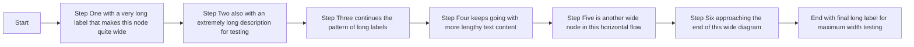

# Horizontal Scroll Test

This file tests that horizontal scrolling works correctly for code blocks, mermaid diagrams, and blockquotes when max line width is enabled.

**Instructions:** Enable max line width (e.g., 80 or 100 characters) in Settings, then view this file in Rendered or Split mode.

---

## Regular Text (Should Respect Max Line Width)

This is regular paragraph text that should wrap according to the max line width setting. It should not extend beyond the configured width and should flow naturally within the content area.

---

## Code Block Test

The following code block has very long lines that should scroll horizontally instead of expanding the layout:

```python
# Very long variable assignments to test horizontal scrolling
very_long_variable_name_for_testing_purposes = "0123456789-0123456789-0123456789-0123456789-0123456789-0123456789-0123456789-0123456789-0123456789"
another_extremely_long_line_of_code_that_definitely_exceeds_any_reasonable_max_line_width_setting = {"key": "value", "another_key": "another_value", "yet_another": "more_data"}
print(f"This is a very long print statement with lots of text: {very_long_variable_name_for_testing_purposes} and more content here to make it even longer")
```

---

## Text After Code Block (Should Still Respect Max Line Width)

This paragraph comes after the code block. If horizontal scrolling is working correctly, this text should still respect the max line width setting and wrap normally. The code block above should NOT have expanded the layout width.

---

## Mermaid Diagram Test

The following mermaid flowchart is intentionally wide to test horizontal scrolling:



---

## Text After Mermaid (Should Still Respect Max Line Width)

This paragraph comes after the mermaid diagram. If horizontal scrolling is working correctly, this text should still respect the max line width setting. Wide diagrams should NOT break the layout for subsequent content.

---

## Blockquote Test

The following blockquote contains very long lines:

> This is a blockquote with an extremely long line of text that should trigger horizontal scrolling: 0123456789-0123456789-0123456789-0123456789-0123456789-0123456789-0123456789-0123456789-0123456789-0123456789

> Another blockquote line that is also very long and should scroll horizontally without breaking the layout width for content that follows this blockquote element in the document.

---

## Text After Blockquote (Should Still Respect Max Line Width)

This final paragraph comes after the blockquote. If all horizontal scrolling is working correctly, this text should wrap normally according to the max line width setting. None of the wide elements above should have affected the layout width.

---

## Nested Blockquote with Code

> Here's a blockquote containing a code block:
> 
> ```bash
> echo "This is a very long command line that should scroll: $(cat /very/long/path/to/some/file/that/has/an/extremely/long/name.txt)"
> ```
> 
> And more text after the code within the blockquote.

---

## Final Verification

If you've scrolled through this entire document and all the regular text paragraphs are wrapping at the max line width (while the code, mermaid, and blockquotes show horizontal scrollbars for their wide content), then the fix is working correctly!
